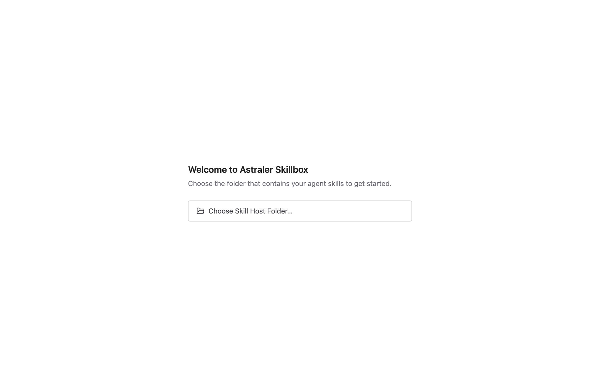

# Astraler Skillbox

Astraler Skillbox is a GUI-first desktop app for managing agent skills. It acts
as a local control center for managing skills across multiple projects and agent
providers.

Skillbox is not just for developers. Users can be content creators, researchers,
marketers, operators, PMs, founders, analysts, or anyone who uses agent skills
across multiple workflows.

## Why Skillbox Exists

Agent coding tools are converging on project-local skill folders. Providers such
as Claude, Codex, Gemini/Antigravity, opencode, Amp, Pi, and similar tools may
load skills from folders inside each project, commonly under conventions such as
`.agents/skills`.

That works well for one project. It gets messy when you have many.

In real agentic coding work, projects multiply quickly and skills evolve even
faster. A skill may start as an experiment, become useful, then be needed across
five different repositories. Installing it globally can pollute projects that do
not need it. Installing it project-by-project can create copies that drift apart.
After a while, it becomes hard to answer basic questions:

- Where is the latest version of this skill?
- Which projects are using it?
- Is this skill global, project-local, or both?
- Did I update every project that depends on it?
- Which provider folders exist in this workspace?
- Which global skills and plugins are affecting this project?

Astraler Skillbox solves this with one local **Skill Host Folder**. You keep the
skills you use, study, install, or develop in that host folder, then link only
the skills a project needs into that project. Update one skill in the host, and
every linked project sees the update through symlink.

The result is a UI-first distribution station for your agent skills: one source
of truth, clear project/provider visibility, and no scattered manual copies.

## Positioning

```text
Skillbox = local-first skill distribution station for the agentic coding era
```

Read the full product story and user journey in the
[Skillbox documentation](docs/index.md).

Skillbox helps users:

- Manage a Skill Host Folder as the source of truth for skills on the machine.
- View provider global skills/config to distinguish global level from project
  level.
- Add projects to the app and scan skills/providers within those projects.
- Install skills from the Skill Host Folder into projects via symlink.
- See which projects are using which skills and by what mechanism.
- Fetch upstream to find out which skills have new versions.
- Manage multiple providers such as Claude, Codex, opencode, Antigravity CLI,
  and other agent providers.

## Download and Open on macOS

Download the latest macOS DMG from
[GitHub Releases](https://github.com/thientranhung/astraler-skillbox/releases).

Current public builds are macOS-only and are not yet Apple notarized. After
copying `Astraler Skillbox.app` into `Applications`, macOS Gatekeeper may show
that Apple cannot verify the app.

To open the app:

1. Click `Done` if macOS shows the verification warning. Do not choose
   `Move to Trash`.
2. Open `System Settings` -> `Privacy & Security`.
3. In the Security section, click `Open Anyway` for `Astraler Skillbox`.
4. Confirm `Open` when macOS asks again.

You can also Control-click or right-click `Astraler Skillbox.app`, choose
`Open`, then confirm `Open`. This Gatekeeper step is temporary until the release
pipeline has Apple Developer ID signing and notarization credentials.

## Screenshots

### First Launch



### Skill Host Folder


## Core Model

```text
Skillbox App
  Main management GUI

Skill Host Folder
  Folder the user selects in the GUI as the source of truth for skills on the machine

Projects
  Projects added to Skillbox

Global Skills
  Provider global-level skills/config currently on the machine

Provider Adapters
  Mapping provider -> folder/path/convention

Database
  SQLite storing management metadata
```

The Skill Host Folder is the folder the user selects and configures in the GUI.
Skillbox uses this folder as the source of truth to distribute skills to other
projects.

```text
<skill-host-folder>/
  .agents/
    skills/
      documentation-and-adrs/
      documentation-writer/
      browser-automation/
```

Any project receives skills from the Skill Host Folder:

```text
<skill-host-folder>/.agents/skills/<skill>
        |
        | symlink
        v
target-project/.agents/skills/<skill>
```

## Install Mechanism

### Symlink

Symlink is the current install mechanism, allowing multiple projects to share a
single source of truth.

- Editing a skill in the Skill Host Folder once means all symlinked projects
  receive the change immediately.
- Best for shared skills and fast updates across many projects.

## Current Product Scope

GUI is the primary experience.

Confirmed tech stack:

- Desktop framework: Electron
- UI framework: React
- Core runtime language: Golang

Main app areas:

- Dashboard
- Skills Library
- Global Skills
- Projects
- Project Detail
- Skill Detail
- Updates
- Settings

Get started:

- [SCAFFOLD.md](SCAFFOLD.md) — prerequisites, dev modes, DB, logs, tests, troubleshooting
- [SMOKE.md](SMOKE.md) — manual end-to-end smoke checklist (slice 1)

See also:

- [Docs Index](docs/index.md)
- [01 Product Brief](docs/01-product-brief.md)
- [02 Product Notes](docs/02-product-notes.md)
- [03 Information Architecture](docs/03-information-architecture.md)
- [04 User Flows](docs/04-user-flows.md)
- [05 Edge Cases And UX States](docs/05-edge-cases-and-ux-states.md)
- [06 Data Model](docs/06-data-model.md)
- [07 Schema Dictionary](docs/07-schema-dictionary.md)
- [08 Provider Model](docs/08-provider-model.md)
- [09 UI Wireframes](docs/09-ui-wireframes.md)
- [10 Technical Architecture](docs/10-technical-architecture.md)
- [11 Tech Stack And Scaffold Decisions](docs/11-tech-stack-and-scaffold-decisions.md)
- [12 Implementation Patterns](docs/12-implementation-patterns.md)
- [Data Model Review Prompt](docs/review-prompts/data-model-review.md)
- [Provider Model Review Prompt](docs/review-prompts/provider-model-review.md)
- [Global Skills Layer Review Prompt](docs/review-prompts/global-skills-layer-review.md)
- [Tech Stack Scaffold Review Prompt](docs/review-prompts/tech-stack-scaffold-review.md)
- [Global Skills Layer Follow-Up Review Result](docs/review-results/global-skills-layer-followup-review.md)
- [Technical Architecture Brainstorm Result](docs/review-results/technical-architecture-brainstorm.md)
- [Transport Decision Brainstorm Result](docs/review-results/transport-decision-brainstorm.md)
- [Tech Stack Scaffold Review Result](docs/review-results/tech-stack-scaffold-review.md)
