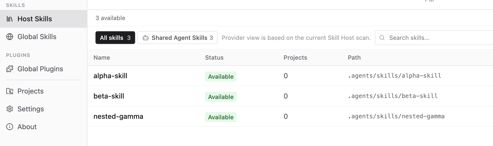
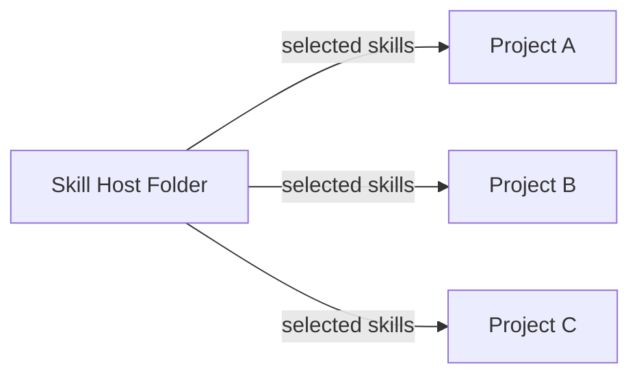
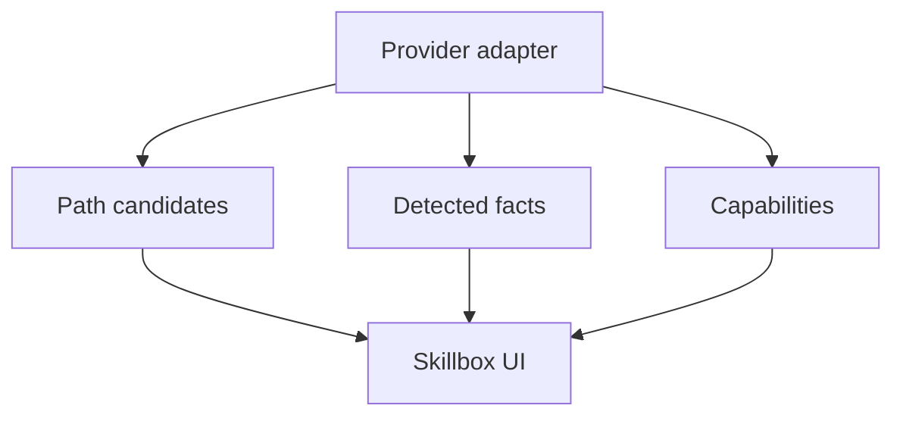
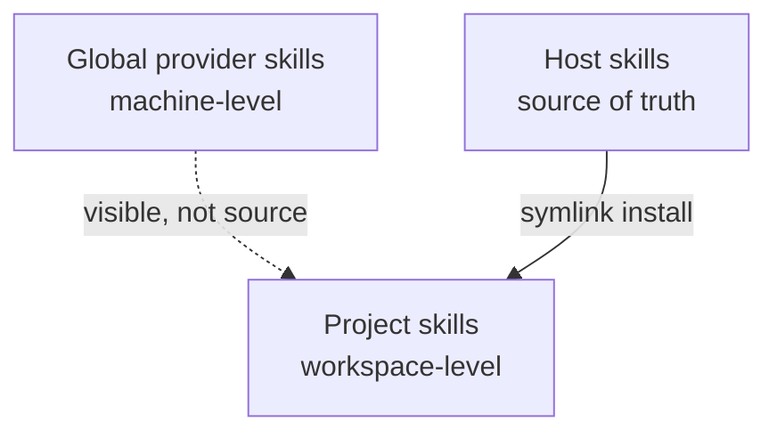
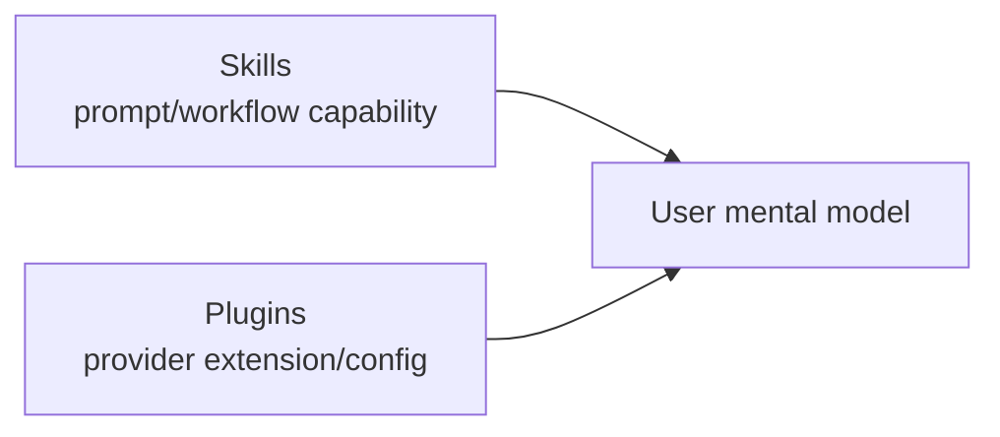

# Core Concepts

## Skill Host Folder

The Skill Host Folder is the local source of truth for skill content.

It is the place where you keep skills before distributing them into projects.
Skillbox scans this folder and uses it as the source path for symlink installs.

```text
<skill-host-folder>/
  .agents/
    skills/
      <skill-name>/
```



## Project

A project is a workspace or repository added to Skillbox.

Skillbox scans the project to detect provider folders, project-level skills, and
provider configuration. A project can then receive selected skills from the Skill
Host Folder.



## Provider

A provider is an agent tool or coding assistant runtime with its own skill and
configuration conventions.

Examples include Claude, Codex, Gemini/Antigravity, opencode, Amp, Pi, and
similar tools. Some providers share conventions such as `.agents/skills`; others
may use their own paths.

Skillbox uses provider adapters so it can display provider facts without mixing
provider-specific path rules into the UI.



## Global Skills

Global skills live at the provider-global level on the machine.

They can be useful, but they can also affect projects unintentionally. Skillbox
shows global skills separately from host skills and project skills so the user
can understand what state belongs to which layer.

## Project Skills

Project skills live inside a specific project.

When Skillbox installs a skill from the host into a project, the stable current
mechanism is symlink. The project sees a local provider-compatible skill folder,
while the real content remains in the Skill Host Folder.



## Symlink Install

Symlink is the current stable install mechanism.

```text
<skill-host-folder>/.agents/skills/<skill>
        |
        | symlink
        v
<project>/.agents/skills/<skill>
```

This keeps one editable source while allowing many projects to use the same
skill.

## Plugin Config

Some providers also have plugin settings or marketplace configuration. Skillbox
shows these separately from skills because plugins and skills affect the agent
workspace in different ways.



## Local-First

Skillbox is local-first. SQLite stores management metadata on the machine, and
the filesystem remains the source of truth for skill content.

The app is usable offline. Outbound network activity is manual-triggered only,
such as checking for plugin or app updates.
