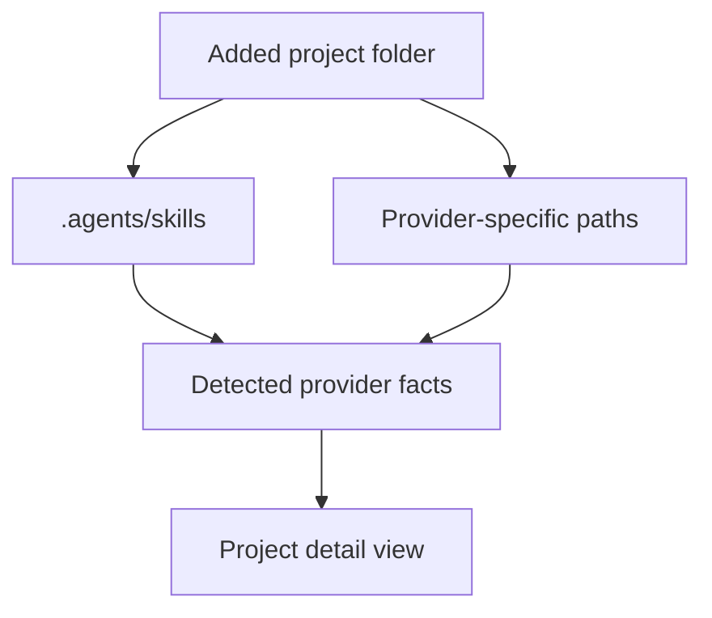
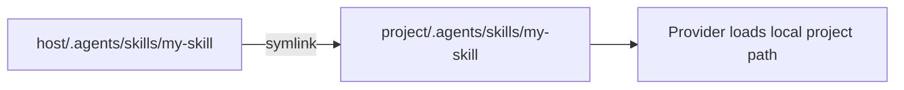
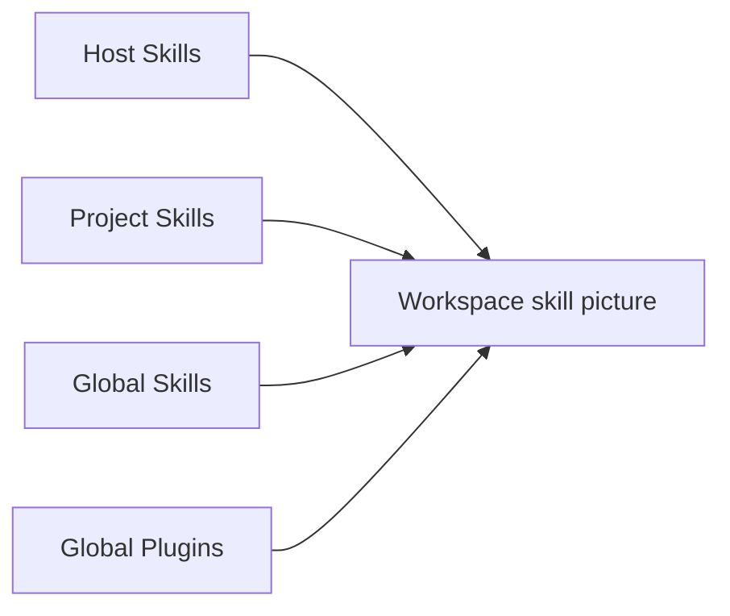

# Getting Started

Astraler Skillbox is a local-first macOS desktop app. It does not require a
Skillbox server, account, telemetry, or background sync.

## Install on macOS

Download the latest DMG from
[GitHub Releases](https://github.com/thientranhung/astraler-skillbox/releases).

Current builds are unsigned and not yet Apple notarized. If macOS blocks the
app:

1. Click `Done` on the Gatekeeper warning.
2. Open `System Settings` -> `Privacy & Security`.
3. Choose `Open Anyway` for `Astraler Skillbox`.
4. Confirm `Open`.

You can also Control-click or right-click the app, choose `Open`, then confirm
`Open`.

## 1. Choose a Skill Host Folder

On first launch, Skillbox asks for a Skill Host Folder.


This folder is the source of truth for your skills. A common shape is:

```text
my-skill-host/
  .agents/
    skills/
      code-review/
      release-qa/
      documentation-and-adrs/
```

You can keep skills you installed, skills you are studying, and skills you are
developing in this host folder.

## 2. Scan the Host

Open `Host Skills` and scan the folder. Skillbox lists the skills it can
distribute into projects.


If no skills appear, make sure the host contains `.agents/skills/<skill-name>`.

## 3. Add a Project

Add a project folder to Skillbox. Skillbox scans provider folders inside the
project and reports what it can manage.

For providers using the shared agent-skill convention, a project-level skill
folder commonly looks like:

```text
target-project/
  .agents/
    skills/
```

Some providers have their own conventions. Skillbox uses provider adapters to
detect and display those paths.



## 4. Install Skills Into the Project

Open the project detail screen, click `Add Skill`, choose the skills the project
needs, and install them.

Current stable installs use symlink:



The project keeps the provider-friendly local path, while the skill content stays
centralized in the host.

## 5. Keep Global State Visible

Open `Global Skills` and `Global Plugins` to see what provider-level state is
present on the machine.



Skillbox separates host skills, project skills, global skills, and plugin config
so you can see what is affecting a project without mixing everything into one
bucket.
