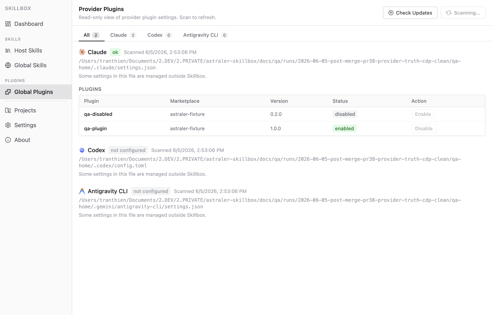
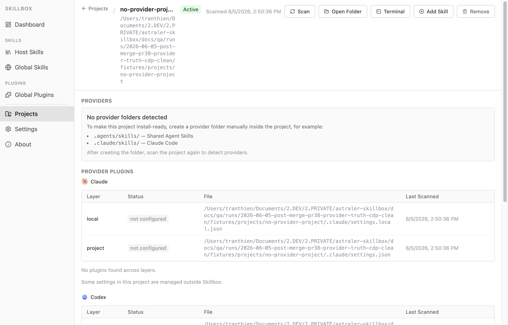

# Screenshots

## First Launch

Choose a Skill Host Folder to become the source of truth for skills on this
machine.

## Host Skills

Scan the host folder and see the skills available for distribution.

## Global Plugins

Inspect provider plugin settings and update state without mixing it into project
skills.

## Project Provider Guidance

Project detail shows which provider folders are detected, missing, or need
manual setup.

