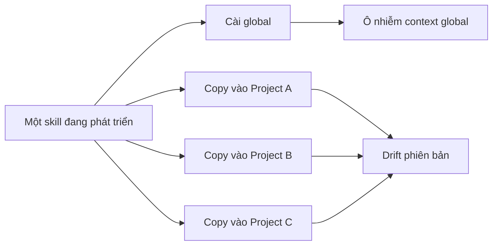
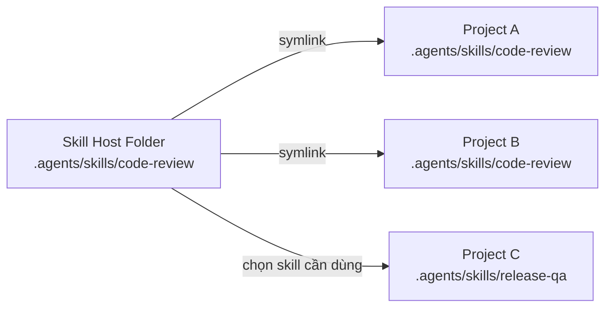
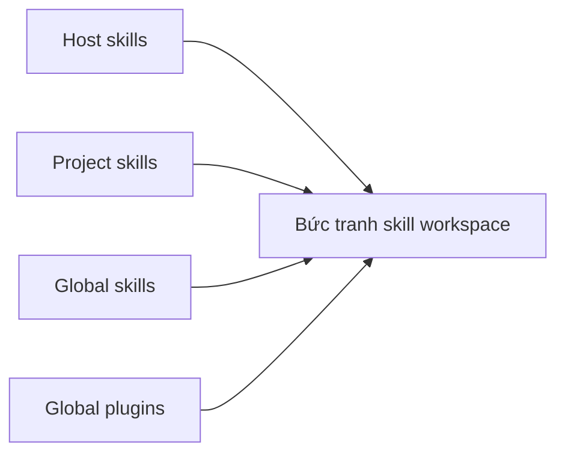

# Astraler Skillbox

Astraler Skillbox là trạm quản lý skill local-first cho thời đại agentic
coding.

Thay vì rải skill vào từng dự án, hoặc cài global rồi để mọi dự án cùng bị ảnh
hưởng, Skillbox đặt một **Skill Host Folder** làm nơi chứa skill gốc. Từ đó, bạn
chọn dự án nào cần skill nào và Skillbox phân phối bằng symlink.


[Bắt đầu sử dụng](../getting-started.md){ .md-button .md-button--primary }
[English](../index.md){ .md-button }

## Vấn đề

Các LLM provider và agent coding tool như Codex, Claude, Gemini, OpenCode,
AmpCode, Pipedream hay các CLI tương tự đang hội tụ về cùng một mô hình: skill
được load từ thư mục trong dự án, thường là `.agents/skills`.

Khi cài skill bằng các lệnh kiểu `npx skill add ...`, người dùng thường phải
chọn:

```text
Install globally or into this project?
```

Cả hai lựa chọn đều có giá trị, nhưng khi số lượng dự án và skill tăng lên,
chúng bắt đầu tạo ra hỗn loạn.

Global skill thì tiện, nhưng dự án A cần skill đó chưa chắc dự án B cũng cần.
Project-local skill thì rõ ràng hơn, nhưng nếu copy vào từng dự án, mỗi dự án
lại có một bản riêng và rất dễ drift. Khi skill được sửa, bạn phải nhớ dự án nào
đang dùng bản nào.



## Ý tưởng trung tâm

Skillbox tạo ra một trạm trung tâm:



Bạn nghiên cứu, cài đặt, hoặc phát triển skill ở Skill Host Folder. Khi dự án
cần skill nào, bạn chọn trong UI và Skillbox symlink skill đó vào project.

Khi update skill ở host folder, toàn bộ project đang link tới skill đó nhận cập
nhật ngay. Không cần copy lại từng nơi.

## Skillbox giúp bạn thấy gì?

Skillbox không chỉ là công cụ cài skill. Nó giúp bạn thấy bức tranh skill trên
máy của mình:



- Skill nào đang nằm trong host folder.
- Project nào đang dùng skill nào.
- Provider nào được phát hiện trong từng project.
- Global skills và project skills đang ảnh hưởng tới workspace.
- Plugin/global provider state nào đang tồn tại.
- Folder provider nào thiếu, lỗi, hoặc cần tạo thủ công.

Mục tiêu rất đơn giản: trước khi skill và project trở nên lộn xộn, bạn nhìn
thấy toàn bộ trạng thái trong một UI.

## Vì sao dùng symlink?

Symlink giữ được cả hai lợi ích:

- Provider vẫn thấy skill ở đúng folder project-local mà nó mong đợi.
- Nội dung thật của skill vẫn chỉ có một bản trong Skill Host Folder.

Đây là cách phù hợp với cách các provider đang load skill từ filesystem, nhưng
giảm rủi ro drift do copy thủ công.

## Đọc tiếp

- [Why Skillbox](../why-skillbox.md) giải thích luận điểm sản phẩm bằng tiếng Anh.
- [Getting Started](../getting-started.md) hướng dẫn cài app, chọn host folder,
  scan skill, add project và install skill.
- [Core Concepts](../core-concepts.md) giải thích Skill Host Folder, provider,
  global skill, project skill, plugin và symlink install.
- [Screenshots](../screenshots.md) hiển thị các màn hình hiện tại.
